# Anime & Manga Discord Bot

A Discord bot that allows users to search for anime and manga information using slash commands. The bot fetches data from external APIs and provides detailed information about your favorite anime and manga series.

## Features

- 🎌 **Anime Search**: Search for anime by name with detailed information
- 📚 **Manga Search**: Search for manga by name with comprehensive details
- ⚡ **Slash Commands**: Modern Discord slash command interface
- 🔍 **Flexible Results**: Choose to get all results or a specific number
- 🛡️ **Rate Limiting**: Built-in protection against API rate limits
- 🎭 **Auto Role Creation**: Automatically creates roles for new servers

## Commands

### Standard Commands

- **`/anime <name> <number_search>`**  
  Search for anime information  
  • `name`: Name of the anime  
  • `number_search`: "all" for all results or a number for specific count  
  **Example**: `/anime "Attack on Titan" 3`

- **`/manga <name> <number_search>`**  
  Search for manga information  
  • `name`: Name of the manga  
  • `number_search`: "all" for all results or a number for specific count  
  **Example**: `/manga "One Piece" all`

- **`/characterinfo <character>`**  
  Search for detailed info about anime/manga characters.

- **`/randomanime`**  
  Suggest a random anime based you preference note or theme

- **`/help`**  
  Display this help message

- **`/terms`**  
  View Terms and Conditions

- **`/privacy`**  
  View Privacy Policy

- **`/setup-channel`**  
  Create and configure bot channels (Admin only)

- **`/buypremium`**  
  Upgrade to premium for exclusive features!

---

### Premium Commands (Subscription required)

- **`/recommend`**  
  Get personalized anime/manga recommendations based on your search history.

- **`/trending`**  
  Show currently trending anime/manga.

- **`/compare <title1> <title2>`**  
  Compare two anime/manga titles by popularity.

- **`/watchlist`**  
  Manage your personal anime/manga watchlist.

- **`/notify`**  
  Get notifications for new episodes or manga chapters.

- **`/advancedanime <genre> <year> <rating> <studio> <count>`**  
  Advanced search for anime.

- **`/advancedmanga <genre> <year> <rating> <author> <count>`**  
  Advanced search for manga.

- **`/advancedcharacter <name> <count>`**  
  Advanced search for anime/manga characters.

- **`/stats`**  
  View your search history and stats.

---

> Premium commands are only available to users who have purchased premium. Use `/buypremium` to unlock all features!

## Required Discord Permissions

To function correctly, the bot requires the following permissions in your server:

- **Send Messages**: Allows the bot to send messages in channels.
- **Use Slash Commands**: Enables the bot to register and use slash commands.
- **Embed Links**: Lets the bot send rich embedded messages.
- **View Channels**: Allows the bot to see and interact in channels.
- **Manage Roles**: Required for automatic role creation and management.
- **Manage Channels**: Needed to create and configure dedicated bot channels (e.g., `#anime-manga`).
- **Read Message History**: Lets the bot read previous messages for context and logging.

> Make sure to grant these permissions when inviting the bot to your server.  
> Example invite link includes all necessary permissions:  
> `https://discord.com/api/oauth2/authorize?client_id=473135420608348162&permissions=274877921280&scope=bot%20applications.commands`

## API Information

This bot uses the [Jikan API](https://jikan.moe/) to fetch anime and manga data from MyAnimeList. The API is free and doesn't require authentication, but has rate limiting in place.

## Architecture & Business Logic

To guarantee the reliability of a large-scale freemium service, the bot relies on an event-driven and serverless architecture. This structure isolates the payment logic from the search logic for maximum security.

1. **Payment Tunnel & Synchronization (Stripe Integration)**

   Subscription management (€4.99 excl. VAT/month) is fully automated to avoid any manual intervention:

   - **Checkout Flow**: The bot generates a unique Stripe Checkout session linked to the user's Discord ID.
   - **Webhooks Security**: A dedicated Azure Function listens for Stripe events. Each request is authenticated via validation of the Stripe signature header to prevent any fraudulent payments.
   - **Reconciliation Process**: To mitigate potential network failures, a Cron Job (Azure Timer Trigger) compares the status of Stripe subscriptions daily with the `subscriptionStatus` entries in MongoDB Atlas.

2. **Performance Optimization (API & Caching)**

   The bot interacts with external APIs (MyAnimeList/Jikan, AniList) while adhering to high availability requirements:

   - **Caching Strategy**: Implementation of an in-memory cache for lightweight responses and a long-term store in MongoDB Atlas for subscription-related records.
   - **Payment Flow Diagram**: See the simplified flow below (Stripe Checkout → Stripe Infrastructure → Azure Function → MongoDB Atlas). The diagram is included as code and will not be rendered in preview.

```mermaid
graph TD
    %% User Action
    U[👤 Utilisateur Discord] -->|Commande /buypremium| B[🤖 Bot Discord]

    %% Payment Flow
    B -->|Génère lien| S[💳 Stripe Checkout]
    S -->|Paiement Validé| SP[🏦 Infrastructure Stripe]

    %% Asynchronous Processes
    SP -->|Envoi Facture PDF| U
    SP -->|Webhook Event| AF[⚡ Azure Function]

    %% Business Logic
    AF -->|Validation Signature| AF
    AF -->|Update subscriptionStatus| DB[(🗄️ MongoDB Atlas)]
    DB -->|Notification Succès| B
    B -->|Confirmation & Rôles| U

    %% Styling
    style SP fill:#6772e5,color:#fff
    style AF fill:#0078d4,color:#fff
    style DB fill:#47a248,color:#fff
```

   - **Rate Limit Management**: Implementation of an intelligent fallback system: if the Jikan API approaches its limit (30 requests/min), the service automatically switches to the AniList GraphQL API to ensure service continuity.

3. **Security & Confidentiality (Privacy by Design)**

   - **Secrets Management**: All API keys and Stripe secrets are encrypted and stored in Azure Key Vault, never in plain text in the runtime environment.
   - **Data Minimization (GDPR)**: The data schema is limited to the bare minimum (Discord IDs and payment status). Data is automatically purged when the bot is removed from a server.

## 📜 Legal notices

### Disclaimer
**See [`DISCLAIMER.md`](DISCLAIMER.md) for the full text.**  
In short, the bot retrieves data from third‑party APIs; the developers are **not** liable for:

1. Accuracy of the retrieved information,  
2. Offensive, inappropriate, or illegal content that may be returned,  
3. Damage or consequences arising from the use of the search commands,  
4. Service interruptions or failures of external APIs.  

By using any search command you accept full responsibility for the results obtained.

### License
The **source code** is released under the **MIT License**.  
See [`LICENSE.md`](LICENSE.md) for the complete license text.

### Trademark notice
The individual project names (**News Nintendo**, **SearchAnimeManga**, **Anime & Manga Discord Bot**, etc.) are **not** registered trademarks on their own.  
They are covered by the registered trademark **SivaGames** (INPI N° 5183463, classes 9 35 38 41 42).  

> Use of these names outside the scope of operating the bots described here requires prior written permission from the owner of the SivaGames trademark.

For the exact wording, consult [`TRADEMARK.md`](TRADEMARK.md).

## 🙋‍♂️ Support
If you encounter any issues or have questions, please open an issue on GitHub or contact the bot administrator at contact@sivagames.com.